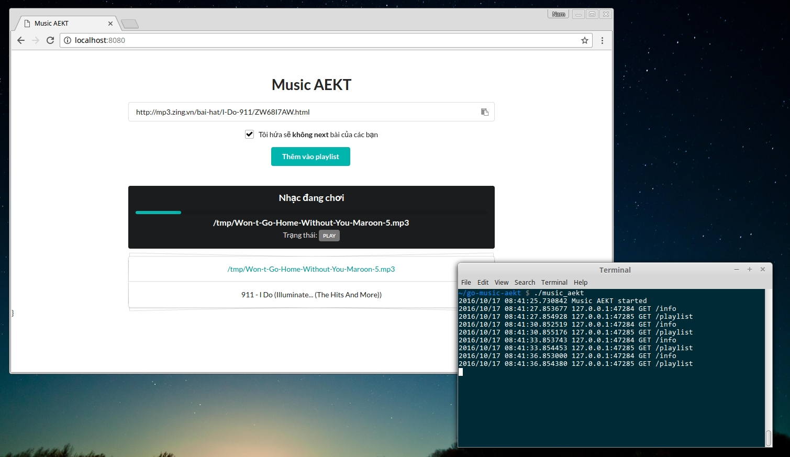

go-music-aekt (Music Anh Em Kĩ Thuật) (Golang version)
===================================================



Support source
==============
* [MP3 Zing](http://mp3.zing.vn)
* [Nhaccuatui](http://www.nhaccuatui.com)

Require
=======

* [Music on console(MOC)](https://moc.daper.net)
* Go ( to build binary file )

How to install (Ubuntu/Debian)
==============================

```
$ sudo apt-get install moc 
```

Build
=====
```
$ cd go-music-aekt
$ go build -o music_aekt .
```

Config
======
```
{
    "UserAgent": "Mozilla/5.0 (X11; Linux x86_64) AppleWebKit/537.36 (KHTML, like Gecko) Chrome/53.0.2785.116 Safari/537.36",
    "SaveLocation": "/tmp",
    "MocDirectory": ".moc",
    "MocPlaylist": "playlist.m3u",
    "Address": "0.0.0.0:8080",
    "VolumeCommand": "vol",
    "VolumeUp": "+",
    "VolumeDown": "-"
}
```
VolumeCommand is dependent on your platform. ( `vol` is a command in Raspberry )

Playlist file is in `$HOME/.moc`


Run
===
1, Music on console
```
$ mocp -S
```

2, Run server
```
$ ./music_aekt
```

Python version
==============
<https://github.com/nghnam/music-aekt>

Contributors
============
* Nguyen Hoang Nam <nguyen.h.nam.vn@gmail.com>
* [Dang Tung Lam](https://github.com/tunglam14/)
